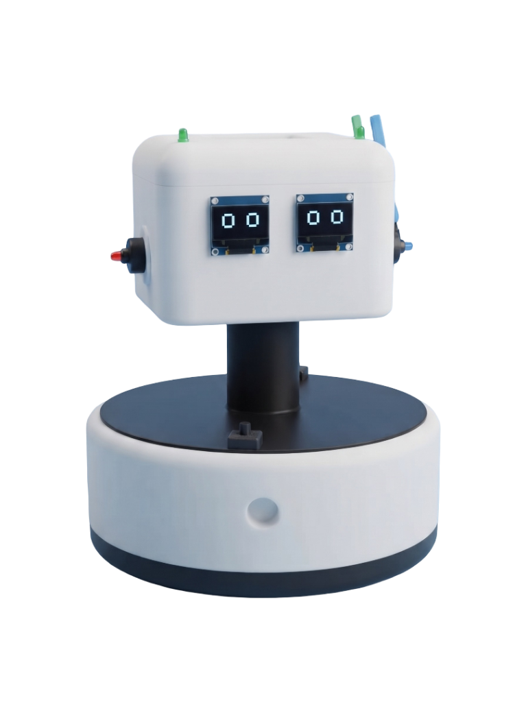

# ⚙️ YANI Puzzle Challenge

> A high-octane sliding puzzle game event, organized by the **Yantrix Robotics & Aeronautics Club** at **DYPIU**.



## 🎯 The Event
The **YANI Puzzle Challenge** is an interactive, time-based sliding puzzle game designed for a live campus event. Participants race against the clock to reassemble the YANI Robot. The system features a brutalist, industrial UI aesthetic, tracking solving times and move counts to rank players on a global live leaderboard.

---

## ✨ Key Features
- **🧩 Interactive Sliding Puzzle:** A dynamic, randomized sliding puzzle logic built from scratch to challenge participants.
- **📱 Fully Responsive:** Carefully optimized for both mobile and desktop (including instant drag-and-drop touch response for mobile devices).
- **🏆 Global Leaderboard:** Real-time leaderboard ranking participants based on completion time and fewest moves.
- **👑 Admin Dashboard:** A secure, protected route for event organizers to track live participant registrations and view game statistics.
- **🎨 Industrial Brutalism UI:** A heavy-machinery, bold aesthetic utilizing stark contrasts, bold typography, hazard stripes, and grayscale elements for a unique visual experience.

---

## 🛠️ Tech Stack
This project was built with modern web development tools to ensure a lightning-fast and seamless experience:

- **Frontend:** [React](https://react.dev/) + [TypeScript](https://www.typescriptlang.org/) + [Vite](https://vitejs.dev/)
- **Styling:** [Tailwind CSS](https://tailwindcss.com/) (with custom brutalist utility classes)
- **Icons:** [Lucide React](https://lucide.dev/)
- **Backend & Database:** [Supabase](https://supabase.com/) (Authentication, Postgres Database)
- **Deployment & Hosting:** [Vercel](https://vercel.com/) (with client-side routing support)

---

## 🚀 Getting Started (Local Development)

If you'd like to run this project locally, follow these steps:

### 1. Clone the Repository
```bash
git clone https://github.com/SanathDambre08/Yantrix-club-event-puzzle-game-.git
cd Yantrix-club-event-puzzle-game-/yani-puzzle
```

### 2. Install Dependencies
```bash
npm install
```

### 3. Setup Environment Variables
Create a `.env.local` file in the root directory and add your Supabase credentials:
```env
VITE_SUPABASE_URL=your_supabase_project_url
VITE_SUPABASE_ANON_KEY=your_supabase_anon_key
```

### 4. Start the Development Server
```bash
npm run dev
```
The game will now be running on `http://localhost:5173`.

---

## 📦 Deployment
This project is configured for seamless deployment on **Vercel**. 
The `vercel.json` file ensures that React Router's client-side SPA routing works correctly without throwing `404 Not Found` errors when refreshing pages.

```json
{
  "rewrites": [
    { "source": "/(.*)", "destination": "/index.html" }
  ]
}
```

---

## 👥 Organizers
Proudly developed for and organized by the **Yantrix Robotics & Aeronautics Club** at **Dr. D. Y. Patil International University (DYPIU)**.
